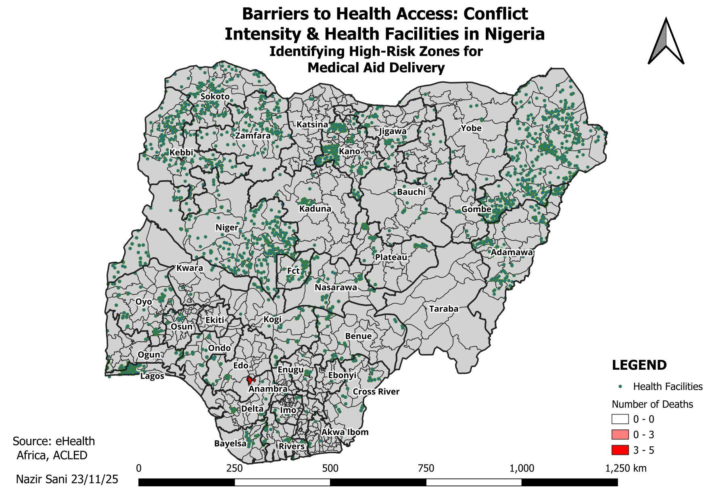

<p align="center">
  
</p>

# 🏥 Healthcare Accessibility Under Conflict Conditions in Nigeria
### *A Geospatial Decision Support Analysis for Humanitarian Medical Aid Planning*

> A GIS-based humanitarian mapping project that integrates conflict intensity and healthcare facility locations to identify high-risk regions where insecurity threatens access to life-saving medical services.

---

# 📌 Executive Summary

Healthcare accessibility is influenced not only by the availability of hospitals and clinics but also by the safety of the routes leading to them.

This project applies Geographic Information Systems (GIS) to examine how armed conflict affects access to healthcare across Nigeria. By integrating conflict intensity data with the spatial distribution of health facilities, the analysis identifies high-risk healthcare zones where humanitarian organizations may require additional security measures to safely deliver medical assistance.

The project was developed as part of the **2025 DSN World GIS Day Map Challenge**, where it was awarded **3rd Place** for excellence in cartographic design, analytical insight, and humanitarian relevance.

---

# 🌍 Business Context

One of the greatest barriers to healthcare delivery in conflict-affected regions is not the absence of medical facilities—but the inability to safely reach them.

Humanitarian organizations frequently face difficult decisions regarding:

- Where medical outreach should be prioritized.
- Which healthcare facilities operate within active conflict zones.
- Which transportation corridors present elevated security risks.
- Where security escorts may be required before deploying personnel or medical supplies.

Traditional tables and reports cannot easily reveal these spatial relationships.

Geospatial analysis provides an effective way to visualize these risks and support evidence-based humanitarian planning. This project overlays conflict intensity with healthcare facility locations to identify vulnerable service areas across Nigeria. :contentReference[oaicite:0]{index=0}

---

# 🎯 Project Objectives

This project was designed to:

- Identify healthcare facilities located within conflict-affected areas.
- Visualize the geographic relationship between conflict intensity and healthcare accessibility.
- Support humanitarian organizations in prioritizing emergency medical interventions.
- Demonstrate how GIS can strengthen evidence-based public health planning.
- Produce a publication-quality cartographic layout suitable for decision-makers.

---

# 🗺️ Study Area

**Country:** Nigeria

The analysis covers all 36 states and the Federal Capital Territory (FCT), using Local Government Areas (LGAs) as the primary administrative unit for conflict aggregation and spatial interpretation.

---

# 🗂 Data Sources

The project integrates multiple spatial datasets.

| Dataset | Source | Purpose |
|----------|--------|----------|
| Conflict Events | ACLED | Conflict intensity and reported fatalities |
| Health Facilities | eHealth Africa | Healthcare facility locations |
| Administrative Boundaries | eHealth Africa | National and LGA boundaries |

These datasets were combined to understand how insecurity influences healthcare accessibility across Nigeria. :contentReference[oaicite:1]{index=1}

---

# 🛠 GIS Workflow

```text
Conflict Dataset (ACLED)
          │
          ▼
Data Cleaning
          │
          ▼
Statistics by Category
(LGA Death Counts)
          │
          ▼
Administrative Boundaries
          │
          ▼
Health Facility Layer
          │
          ▼
Spatial Overlay
          │
          ▼
Graduated Symbology
          │
          ▼
Cartographic Design
          │
          ▼
Decision Support Map
```

---

# 🔍 Analytical Approach

The project was completed using **QGIS**, applying standard GIS workflows for humanitarian spatial analysis.

### Techniques Applied

- Data Cleaning
- Spatial Data Integration
- Statistics by Category
- Graduated Symbology
- Layer Styling
- Vector Mapping
- Cartographic Layout Design
- Coordinate Reference System (CRS) Management

The final output combines quantitative conflict data with healthcare infrastructure to produce an intuitive map suitable for humanitarian decision-making. :contentReference[oaicite:2]{index=2}

---

# 🗺 Final Map Output

<p align="center">
  
</p>

*Figure 1. Spatial relationship between conflict intensity and healthcare facility distribution across Nigeria.*

---

# 📈 Key Findings

## 1️⃣ Conflict Creates Hidden Barriers to Healthcare

The analysis demonstrates that healthcare accessibility depends not only on facility availability but also on the surrounding security environment.

Regions experiencing high conflict intensity become operational barriers for healthcare delivery despite having existing facilities.

---

## 2️⃣ High-Risk Healthcare Zones

The spatial overlay highlights concentrations of healthcare facilities located within elevated conflict areas, particularly across parts of North-East Nigeria.

These facilities may require additional logistical planning before humanitarian services can safely reach vulnerable populations. :contentReference[oaicite:3]{index=3}

---

## 3️⃣ Decision Support for Humanitarian Organizations

The completed map provides a visual decision-support tool that enables stakeholders to:

- Prioritize emergency interventions.
- Plan safer medical supply routes.
- Identify regions requiring security support.
- Improve allocation of humanitarian resources.

---

# 💡 Strategic Recommendations

Based on the analysis, the following recommendations are proposed.

### 1. Prioritize High-Risk Health Zones

Focus humanitarian planning on conflict-affected regions where healthcare facilities remain operational but difficult to access.

---

### 2. Strengthen Secure Medical Supply Chains

Coordinate with security agencies to establish protected delivery routes for vaccines, medicines, and emergency medical equipment.

---

### 3. Integrate GIS into Humanitarian Planning

Institutionalize GIS-based decision support within emergency response operations to improve planning efficiency and resource allocation.

---

# 🏆 Project Achievement

🥉 **Awarded 3rd Place**

**DSN World GIS Day Map Challenge 2025**

The project was recognized for:

- Cartographic Quality
- Humanitarian Relevance
- Spatial Analysis
- Professional Map Layout
- Decision Support Value

---

# 📂 Project Deliverables

🗺 **GIS Map Layout**

A publication-quality map illustrating conflict intensity alongside healthcare facility distribution.

➡️ **Map Preview:** `DSN_Hackathon_page-0001.jpg`

---

📄 **Challenge Submission Report**

Describes the project objectives, methodology, analytical process, and findings.

➡️ **View Submission Report:** `2025_DSN_Map_Challenge.pdf`

---

# 💻 Skills Demonstrated

- Geographic Information Systems (GIS)
- QGIS
- Spatial Analysis
- Cartography
- Humanitarian Mapping
- Public Health GIS
- Spatial Data Integration
- Data Visualization
- Decision Support Analytics
- Coordinate Reference Systems (CRS)

---

# 📚 Lessons Learned

This project reinforced the value of GIS as a decision-support tool rather than simply a mapping application.

By integrating conflict intelligence with healthcare infrastructure, the analysis demonstrated how spatial analytics can uncover operational risks that are difficult to identify through traditional reports alone.

The experience also strengthened practical skills in humanitarian mapping, cartographic communication, and evidence-based spatial decision-making.

---

# 📂 Repository Contents

```text
project-gis-health/
│
├── README.md
├── DSN_Hackathon_page-0001.jpg
├── 2025_DSN_Map_Challenge.pdf
└── Hackathon_Submission_NazirSani.pdf
```

---

# 🔗 Return to Portfolio

⬅️ **[Back to Main Portfolio](../)**

---

> **This project forms part of my Core & Geospatial Data Analytics Portfolio and demonstrates practical experience in GIS, humanitarian mapping, public health analytics, spatial decision support, and cartographic communication.**
