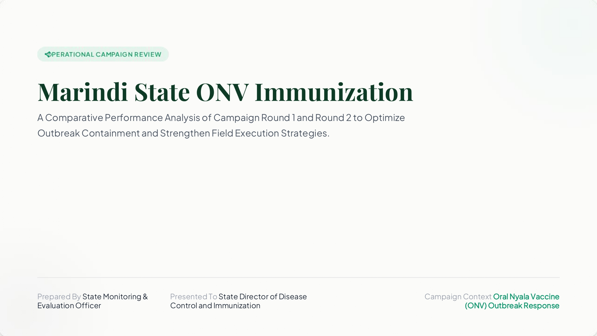
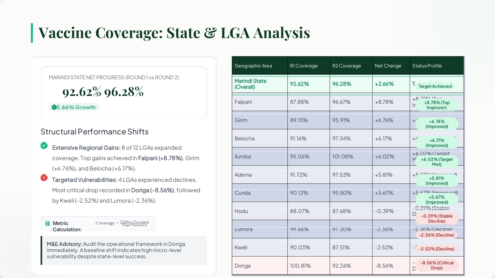
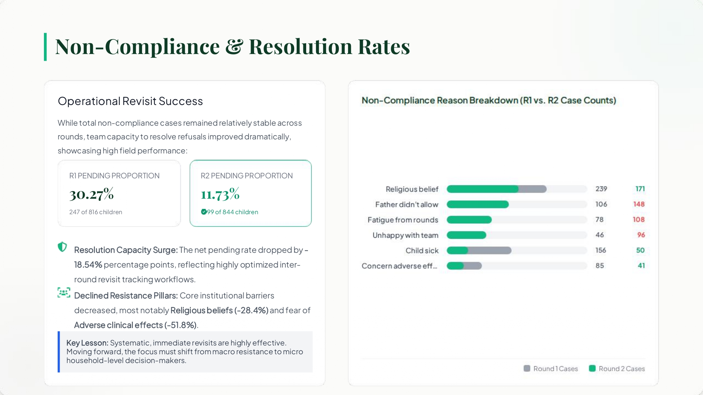
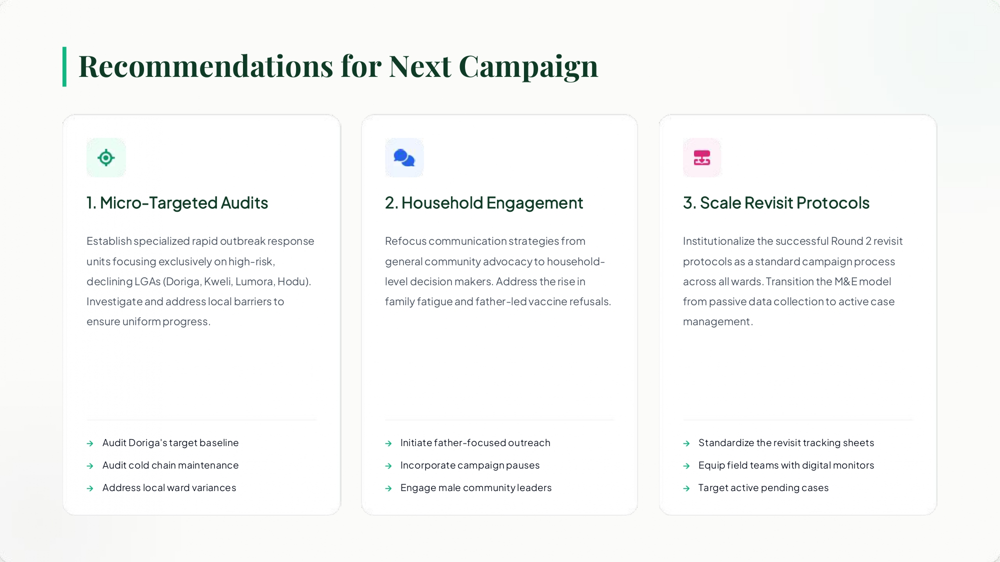

<p align="center">
  
</p>

# 🏥 Public Health Outbreak Response Audit
### *Operational Campaign Performance Analysis for the Marindi State Oral Nyala Vaccine (ONV) Campaign*

> A comprehensive monitoring and evaluation (M&E) case study analyzing vaccination coverage, operational efficiency, and vaccine hesitancy trends across two immunization rounds using Microsoft Excel.

---

# 📌 Executive Summary

This project presents a comprehensive operational audit of the **Marindi State Oral Nyala Vaccine (ONV) Campaign**, conducted over two vaccination rounds.

Acting as the **State Monitoring & Evaluation (M&E) Officer**, I analyzed campaign performance data collected across **State → Local Government Area (LGA) → Ward** levels to evaluate vaccination coverage, investigate non-compliance patterns, identify operational weaknesses, and provide evidence-based recommendations for future outbreak response campaigns.

Using advanced Microsoft Excel functions, dynamic lookup techniques, and executive-level reporting, I transformed raw campaign records into actionable insights that support strategic decision-making.

---

# 🎯 Business Problem

Despite achieving high statewide vaccination coverage, public health programmes often struggle to identify localized operational failures hidden beneath aggregated statistics.

The Ministry of Health required an analytical review capable of answering critical questions:

- Which LGAs improved between campaign rounds?
- Which locations experienced declining performance?
- What factors contributed to vaccine refusal?
- Were field teams successfully resolving non-compliance cases?
- What operational improvements should be implemented before the next campaign?

This project answers those questions through data-driven analysis and executive reporting.

---

# 📋 Project Objectives

The project was designed to:

- Measure vaccination coverage across both campaign rounds
- Compare performance at State and LGA levels
- Evaluate changes in vaccination coverage
- Analyze non-compliance and pending refusal cases
- Decode vaccine refusal reasons using dynamic Excel lookups
- Identify behavioural and operational trends
- Produce an executive presentation for senior decision-makers

These objectives align with the original assessment requirements. :contentReference[oaicite:0]{index=0}

---

# 🗂 Dataset Overview

The dataset represents a simulated immunization campaign conducted across multiple LGAs in Marindi State.

### Data Hierarchy

```
State
   ↓
Local Government Area (LGA)
   ↓
Ward
```

Each record contains campaign indicators including:

- Target population
- Children vaccinated
- Vaccination coverage
- Non-compliance counts
- Pending refusal cases
- Vaccine refusal reason codes
- Campaign Round (Round 1 & Round 2)

---

# 🛠 Analytical Workflow

```
Raw Campaign Dataset
        │
        ▼
Data Validation & Cleaning
        │
        ▼
Coverage Calculations
        │
        ▼
XLOOKUP Reason Mapping
        │
        ▼
Trend & Comparative Analysis
        │
        ▼
Executive Dashboard
        │
        ▼
Strategic Recommendations
```

---

# 🔍 Analytical Approach

The entire project was completed using **Microsoft Excel** without manual calculations.

Techniques applied include:

- Relative & Absolute Cell Referencing
- XLOOKUP
- IF Statements
- ISBLANK
- Arithmetic Functions
- Percentage Calculations
- Dynamic Formula Replication
- Data Validation
- Executive Dashboard Design

Coverage was calculated using:

\[
\textbf{Coverage}=\frac{\text{Children Vaccinated}}{\text{Target Population}}
\]

---

# 📈 Key Findings

## 1️⃣ Statewide Campaign Performance

---

### 📊 Campaign Coverage Dashboard

<p align="center">
  
</p>

*Figure 1. Statewide vaccination coverage comparison across Round 1 and Round 2, highlighting high-performing and underperforming LGAs.*

The campaign achieved a significant improvement between the two rounds.

| Metric | Round 1 | Round 2 |
|---------|---------|---------|
| State Coverage | **92.62%** | **96.28%** |

### Net Improvement

✅ **+3.66%**

This demonstrates overall operational success across the state while masking localized performance gaps identified during the analysis. The presentation highlights these gains and contrasts them with declining LGAs. :contentReference[oaicite:1]{index=1}

---

## 2️⃣ Local Government Performance

The analysis identified substantial geographical variation.

### Highest Improvements

- Falpani (+8.78%)
- Girim (+6.76%)
- Belocha (+6.17%)

### Areas Requiring Immediate Investigation

- Doriga (-8.56%)
- Kweli (-2.52%)
- Lumora (-2.36%)

Although statewide performance improved, **Doriga recorded a critical decline**, indicating localized operational challenges requiring targeted intervention. :contentReference[oaicite:2]{index=2}

---

## 3️⃣ Non-Compliance Analysis

Operational revisit strategies produced substantial improvements.

### Pending Refusal Rate

| Round | Pending Rate |
|--------|--------------|
| Round 1 | **30.27%** |
| Round 2 | **11.73%** |

### Improvement

✅ **18.54 percentage-point reduction**

This indicates that systematic follow-up activities significantly improved case resolution efficiency. :contentReference[oaicite:3]{index=3}

---

## 4️⃣ Behavioural Insights

---

### 📉 Non-Compliance & Behavioural Analysis Dashboard

<p align="center">
  
</p>

*Figure 2. Analysis of vaccine refusal patterns, pending non-compliance cases, and behavioural shifts between campaign rounds.*

The analysis revealed an important behavioural shift.

Institutional barriers declined substantially.

Examples include:

- Religious belief refusals ↓
- Fear of adverse effects ↓

However,

Father-led vaccine refusal increased by

**39.6%**

This suggests that future interventions should shift from community-wide messaging toward targeted household engagement strategies. :contentReference[oaicite:4]{index=4}

---

# 💡 Strategic Recommendations

<p align="center">
  
</p>

*Figure 3. Executive recommendations prepared for the State Director of Disease Control based on analytical findings.*

Based on the analysis, three priority actions were recommended.

## 1. Conduct Micro-Targeted Operational Audits

Focus rapid-response teams on:

- Doriga
- Kweli
- Lumora
- Hodu

to investigate localized implementation failures.

---

## 2. Strengthen Household Engagement

Develop communication campaigns aimed at:

- Fathers
- Household decision-makers
- Male community leaders

to reduce family-level vaccine resistance.

---

## 3. Institutionalize Revisit Protocols

Standardize successful Round 2 revisit workflows across all LGAs to improve future campaign effectiveness and reduce unresolved non-compliance cases. These recommendations mirror the executive presentation prepared for campaign leadership. :contentReference[oaicite:5]{index=5}

---

# 📊 Project Deliverables

📄 **Excel Analytical Model**

- Dynamic formulas
- XLOOKUP implementation
- Automated calculations
- Data validation
- Transparent analytical workflow

➡️ **[Download Excel Workbook](./Nazir_Sani_Sol.xlsx)**

---

📑 **Executive Presentation**

Prepared for:

**State Director of Disease Control & Immunization**

Includes:

- Campaign performance review
- LGA comparison
- Behavioural analysis
- Operational recommendations

➡️ **[View Presentation](./Operational_Campaign_Review_Marindi_Presentation_Slide.pdf)**

---

# 💻 Skills Demonstrated

- Microsoft Excel
- Data Cleaning
- Monitoring & Evaluation (M&E)
- Data Validation
- XLOOKUP
- IF Functions
- Analytical Reporting
- Public Health Analytics
- Data Storytelling
- Executive Presentation Design
- Operational Performance Analysis

---

# 📚 Lessons Learned

This project reinforced the importance of moving beyond aggregate performance metrics when evaluating public health programmes.

Although statewide vaccination coverage improved considerably, deeper analysis revealed localized operational weaknesses and evolving behavioural barriers that would have remained hidden without structured analytical investigation.

The experience demonstrated how rigorous data analysis can transform routine monitoring data into strategic recommendations that directly support evidence-based public health decision-making.

---

# 📂 Repository Contents

```
project-marindi-immunization/
│
├── Nazir_Sani_Sol.xlsx
├── Operational_Campaign_Review_Marindi_Presentation_Slide.pdf
├── cover.png
└── README.md
```

---

# 🔗 Return to Portfolio

⬅️ **[Back to Main Portfolio](../)**

---

This project is part of my Core & Geospatial Data Analytics Portfolio and demonstrates practical experience in monitoring & evaluation, operational analytics, executive reporting, and public health decision support.**
